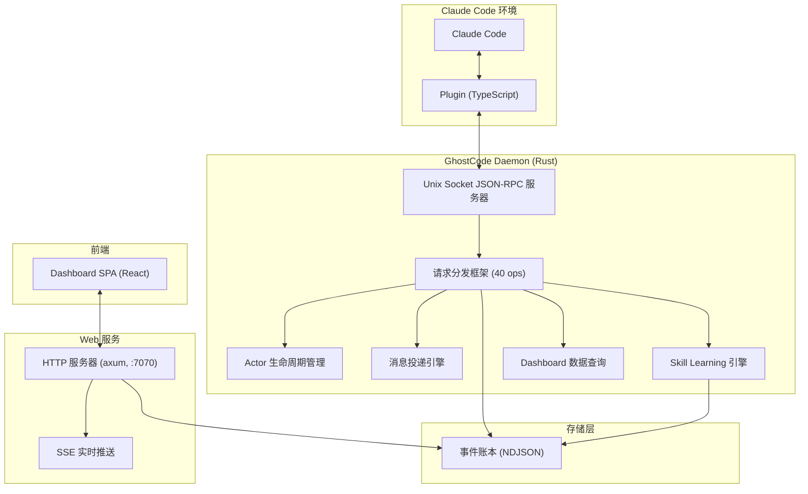

# GhostCode

> 基于 Rust 核心 + TypeScript 薄壳的多 Agent 协作开发平台，作为 Claude Code Plugin 分发。

## 功能特性

- **多 Agent 协作** - 支持多个 Claude Code 实例作为 Actor 协同工作，通过 Group 进行组织管理
- **Magic Keywords** - 在 prompt 中输入关键词（ralph / autopilot / team / ultrawork）即可切换工作模式
- **Skill Learning** - 自动从会话交互中提取可复用模式，持续积累项目专属技能库
- **事件账本** - Append-only NDJSON 格式持久化所有状态变更，支持完整审计回溯
- **Web Dashboard** - 暗色主题实时监控面板，展示事件时间轴、Agent 状态和 Skill 候选
- **多模型路由** - 支持 Claude / Codex / Gemini 多模型任务路由，策略灵活可配置
- **Ralph 验证循环** - 代码变更经过 7 项自动验证，保障代码质量

## 架构概览



## 项目结构

```
GhostCode/
  Cargo.toml                    # Workspace 根配置（Rust 1.75+）
  crates/
    ghostcode-types/            # 共享类型定义（Event、IPC、Actor、Dashboard、Skill）
    ghostcode-ledger/           # Append-only 事件账本（NDJSON + flock 写锁）
    ghostcode-daemon/           # 守护进程（Unix Socket 服务器、消息分发、Skill Learning）
    ghostcode-mcp/              # MCP 工具定义
    ghostcode-router/           # 多模型路由引擎（DAG 拓扑排序、任务调度）
    ghostcode-web/              # Web Dashboard HTTP + SSE 服务器（axum 0.7）
  src/
    plugin/                     # TypeScript Claude Code Plugin
      src/
        hooks/                  # Hook 处理器（PreToolUse / Stop / UserPromptSubmit）
        keywords/               # Magic Keywords 检测与状态管理
        learner/                # Skill Learning 会话缓冲与提取
        daemon.ts               # Daemon 生命周期管理
        ipc.ts                  # Unix Socket JSON-RPC IPC 桥接
  docs/
    architecture.md             # 系统架构详细说明
    getting-started.md          # 快速上手指南
    research.md                 # 前期研究约束集
```

## 快速开始

### 环境要求

| 工具 | 最低版本 | 说明 |
|------|---------|------|
| Rust | 1.75+ | `rustup update stable` |
| Node.js | 18+ | 推荐使用 volta 管理 |
| pnpm | 8+ | `npm install -g pnpm` |
| Claude Code | 最新版 | Claude Code CLI |

### 安装

```bash
# 克隆仓库
git clone <repository-url>
cd GhostCode

# 构建 Rust 核心
cargo build --release

# 安装 Plugin 依赖
cd src/plugin
pnpm install
pnpm build
```

详细步骤请参阅 [快速上手指南](docs/getting-started.md)。

## 开发指南

### 构建

```bash
# 构建所有 crate
cargo build

# 仅构建指定 crate
cargo build -p ghostcode-daemon

# 发布构建（优化）
cargo build --release
```

### 测试

```bash
# 运行所有测试
cargo test

# 运行指定 crate 的测试
cargo test -p ghostcode-ledger

# 运行属性基测试（PBT）
cargo test -p ghostcode-daemon -- skill_learning_pbt

# Plugin 测试
cd src/plugin
pnpm test
```

### 代码规范

- Rust 代码遵循 `clippy` 标准：`cargo clippy -- -D warnings`
- TypeScript 代码使用严格模式
- 所有注释使用中文
- 遵循 TDD 流程：Red -> Green -> Refactor

### 贡献

1. Fork 本仓库
2. 创建功能分支：`git checkout -b feat/my-feature`
3. 提交变更（遵循 [Conventional Commits](https://www.conventionalcommits.org/)）
4. 提交 Pull Request

## 参考项目

GhostCode 融合了以下开源项目的核心思路：

| 项目 | 贡献 | 许可证 |
|------|------|--------|
| [CCCC](https://github.com/ChesterRa/cccc) | 通信内核（Daemon + 消息可靠投递 + 多 Runtime） | Apache-2.0 |
| [ccg-workflow](https://github.com/fengshao1227/ccg-workflow) | 代码安全策略（多模型路由 + team-*/spec-* 流程） | MIT |
| [oh-my-claudecode](https://github.com/Yeachan-Heo/oh-my-claudecode) | 用户体验（Magic Keywords + Ralph 验证循环） | MIT |

## 许可证

MIT License - 详见 [LICENSE](LICENSE) 文件。

---

作者：Atlas.oi
