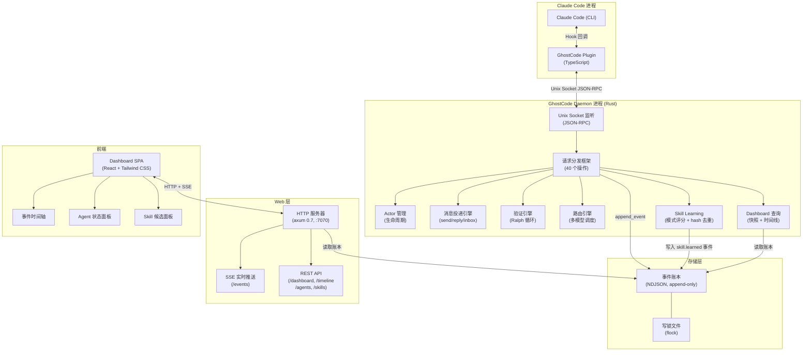
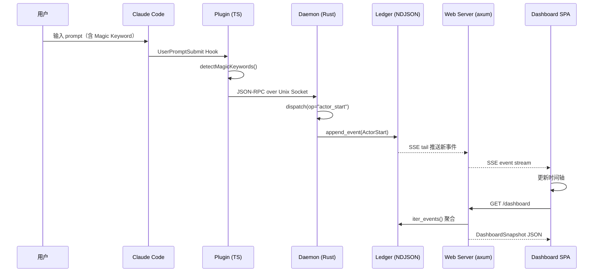
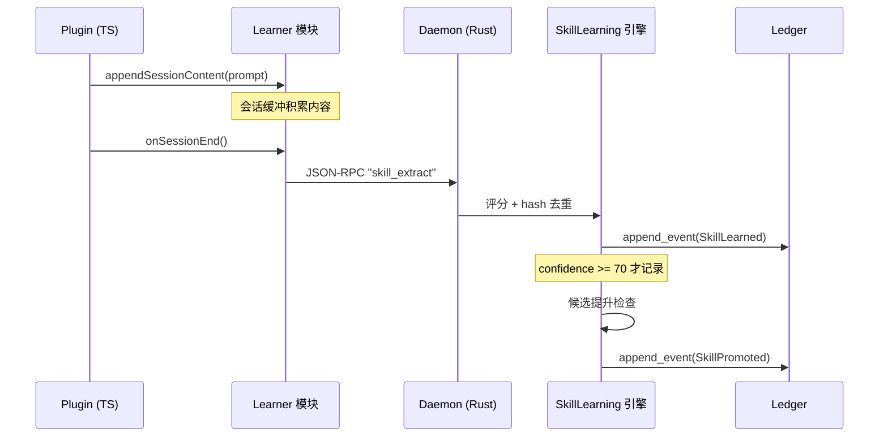
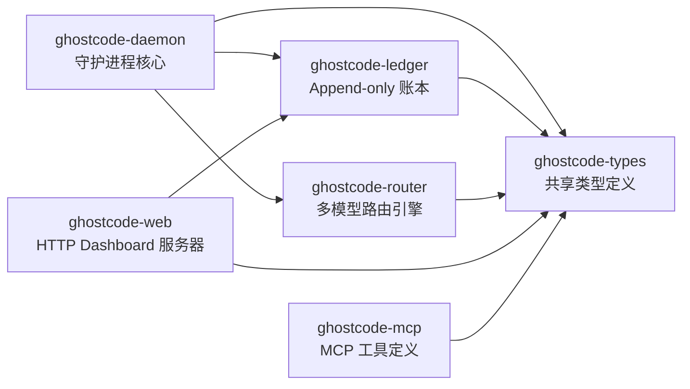

# GhostCode 系统架构说明

> 作者：Atlas.oi
> 日期：2026-03-03

## 系统架构概览

GhostCode 采用「Rust 核心 + TypeScript 薄壳」的分层架构，以 Unix Socket 为边界分离插件层与守护进程层，通过 NDJSON 账本实现数据持久化，并通过 HTTP + SSE 向 Web Dashboard 推送实时数据。



## 数据流图

### Plugin -> Daemon -> Ledger -> Dashboard



### Skill Learning 数据流



## 各 Crate 职责与依赖关系



### ghostcode-types

**职责**: 整个 workspace 的共享类型定义，所有 crate 的数据契约层。

| 模块 | 内容 |
|------|------|
| `event` | `Event` 结构体、`EventKind` 枚举（18 种事件类型） |
| `ipc` | `DaemonRequest` / `DaemonResponse` IPC 协议类型 |
| `actor` | Actor 定义（id、runtime、status） |
| `group` | Group 定义（id、name、state） |
| `addr` | Unix Socket 地址类型 |
| `dashboard` | Dashboard DTO（`LedgerTimelineItem`、`AgentStatusView`、`DashboardSnapshot`、`TimelinePage`） |
| `skill` | Skill Learning 类型（`SkillMetadata`、`LearnedSkill`、`PatternDetection`） |

### ghostcode-ledger

**职责**: 事件持久化存储，保证写入原子性和读取一致性。

核心函数：
- `append_event()` - flock 写锁 + append 模式原子追加
- `read_last_lines()` - 4KB 块反向扫描，高效读取最近 N 条
- `iter_events()` - 全量迭代，损坏行自动跳过（[ERR-1] 容错）
- `count_events()` - 统计有效事件数量

查询模块 (`query`)：
- 时间线分页查询
- Agent 状态聚合
- Dashboard 快照生成

### ghostcode-daemon

**职责**: GhostCode 的运行时核心，管理所有 Actor 的生命周期和通信。

子模块：

| 子模块 | 职责 |
|--------|------|
| `server` | Unix Socket 监听、连接管理、优雅关闭（30s 请求超时，2s 关闭等待） |
| `dispatch` | 40 个 op 的请求分发框架 |
| `actor_mgmt` | Actor 注册、启动、停止、移除 |
| `messaging` | send/reply/inbox 消息投递引擎 |
| `verification` | Ralph 验证循环（7 项自动验证） |
| `routing` | 多模型任务路由状态管理 |
| `skill_learning` | 片段评分、hash 去重、候选提升 |
| `dashboard` | Dashboard 数据查询接口 |
| `hud` | HUD 状态栏数据 |
| `lifecycle` | Daemon 启动与关闭流程 |

### ghostcode-router

**职责**: 多模型任务路由引擎，支持 DAG 拓扑排序和并行/顺序/回退策略。

- `dag` - 有向无环图拓扑排序（`TaskNode`、`topological_sort`）
- `task_format` - 任务格式解析

### ghostcode-web

**职责**: 独立 HTTP 服务器，向 Dashboard SPA 提供数据接口（默认绑定 `127.0.0.1:7070`）。

| 端点 | 方法 | 说明 |
|------|------|------|
| `/dashboard` | GET | DashboardSnapshot 快照（聚合视图） |
| `/timeline` | GET | 时间线分页查询（支持 cursor + limit） |
| `/agents` | GET | Agent 状态列表 |
| `/skills` | GET | Skill 候选列表 |
| `/events` | GET | SSE 实时事件流（tail NDJSON 账本） |

## 通信协议说明

### JSON-RPC over Unix Socket

Plugin（TypeScript）与 Daemon（Rust）通过 Unix Socket 通信，协议为换行分隔的 JSON-RPC。

**请求格式**：

```json
{
  "op": "actor_start",
  "params": {
    "group_id": "my-group",
    "actor_id": "worker-1"
  }
}
```

**响应格式（成功）**：

```json
{
  "ok": true,
  "data": {
    "actor_id": "worker-1",
    "status": "active"
  }
}
```

**响应格式（错误）**：

```json
{
  "ok": false,
  "error": "Actor worker-1 already running"
}
```

### 已实现的操作（40 个）

| 类别 | 操作 |
|------|------|
| 核心 | ping, shutdown |
| Group 管理 | group_create, group_show, group_start, group_stop, group_delete, group_set_state, groups |
| Actor 管理 | actor_add, actor_list, actor_start, actor_stop, actor_remove |
| 消息 | send, reply, inbox_list, inbox_mark_read, inbox_mark_all_read |
| Headless | headless_status, headless_set_status |
| 路由（Phase 2） | route_task, route_task_parallel, route_status, route_cancel, session_list |
| 验证（Phase 3） | verification_start, verification_status, verification_cancel |
| HUD（Phase 3） | hud_snapshot, hud_update |
| Dashboard（Phase 4） | dashboard_snapshot, dashboard_timeline, dashboard_agents |
| Skill Learning（Phase 4） | skill_list, skill_extract, skill_promote, skill_reject, skill_get |

## 事件系统（EventKind 枚举）

账本中存储的所有事件均属于以下 18 种类型之一：

| 类别 | EventKind | 序列化值 |
|------|-----------|---------|
| Group 生命周期 | GroupCreate | `group.create` |
| | GroupUpdate | `group.update` |
| | GroupStart | `group.start` |
| | GroupStop | `group.stop` |
| | GroupSetState | `group.set_state` |
| Actor 生命周期 | ActorAdd | `actor.add` |
| | ActorUpdate | `actor.update` |
| | ActorStart | `actor.start` |
| | ActorStop | `actor.stop` |
| | ActorRemove | `actor.remove` |
| 消息 | ChatMessage | `chat.message` |
| | ChatRead | `chat.read` |
| | ChatAck | `chat.ack` |
| 系统 | SystemNotify | `system.notify` |
| Skill Learning | SkillLearned | `skill.learned` |
| | SkillPromoted | `skill.promoted` |
| | SkillRejected | `skill.rejected` |
| Dashboard | DashboardViewed | `dashboard.viewed` |

### 事件结构

```json
{
  "v": 1,
  "id": "a1b2c3d4e5f6a1b2c3d4e5f6a1b2c3d4",
  "ts": "2026-03-03T10:30:00.000000Z",
  "kind": "actor.start",
  "group_id": "my-project",
  "scope_key": "default",
  "by": "user",
  "data": {}
}
```

字段说明：
- `v` - 协议版本号，固定为 1
- `id` - UUID v4 hex 格式（32 字符，无连字符）
- `ts` - ISO 8601 UTC 微秒精度时间戳
- `kind` - 事件类型（点分隔 snake_case）
- `group_id` - 所属 Group 标识
- `scope_key` - 作用域键
- `by` - 触发者（actor_id 或 "user"）
- `data` - 事件负载（任意 JSON 对象）

## 核心设计原则

1. **单写者原则** - Daemon 是唯一的状态写入者，消除竞态条件
2. **代码主权** - Claude 独占文件写入权，外部模型只能建议
3. **事件溯源** - 所有状态变更以不可变事件形式追加到账本，支持完整审计回溯
4. **协议优先** - 通过标准 JSON-RPC 接口通信，不依赖内部实现细节
5. **质量保证** - TDD + PBT 混合驱动开发：Red -> Green -> Refactor
